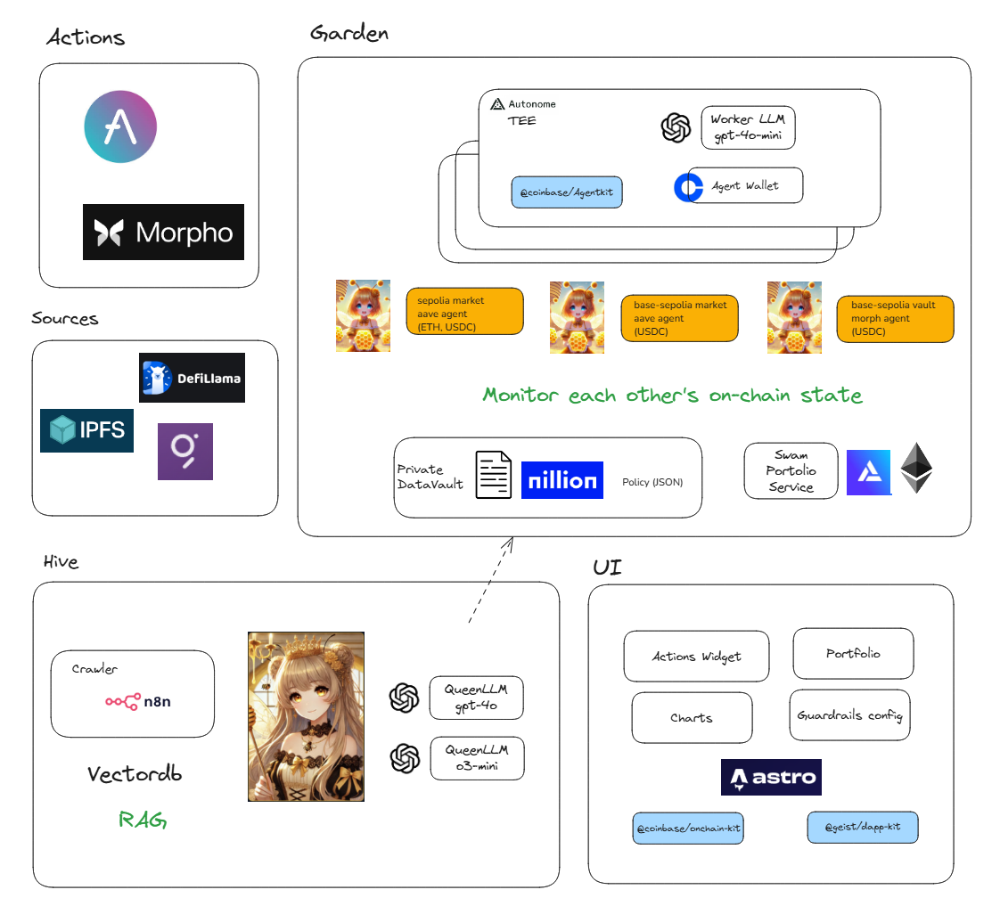
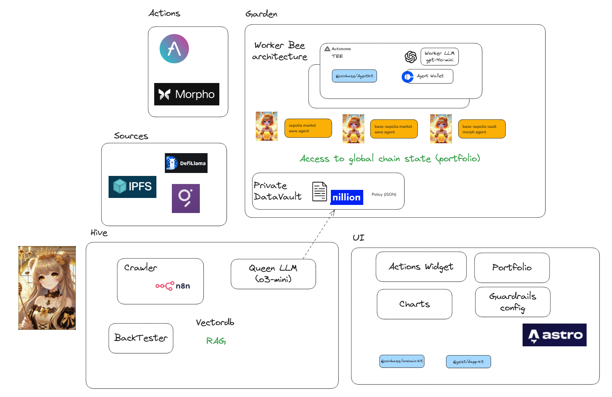
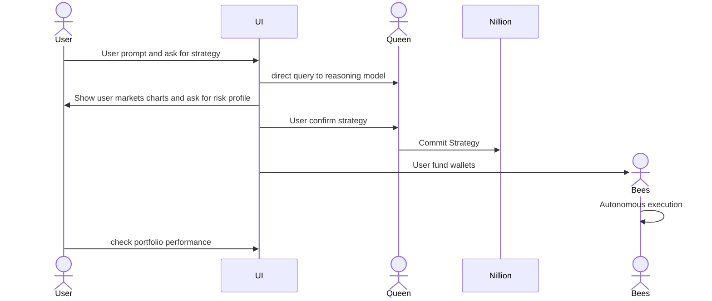
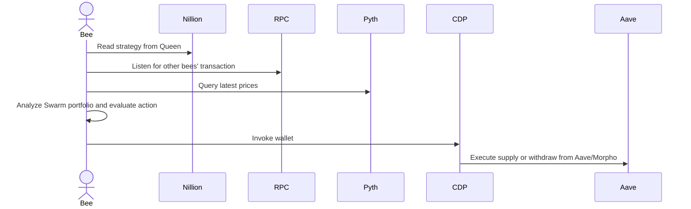
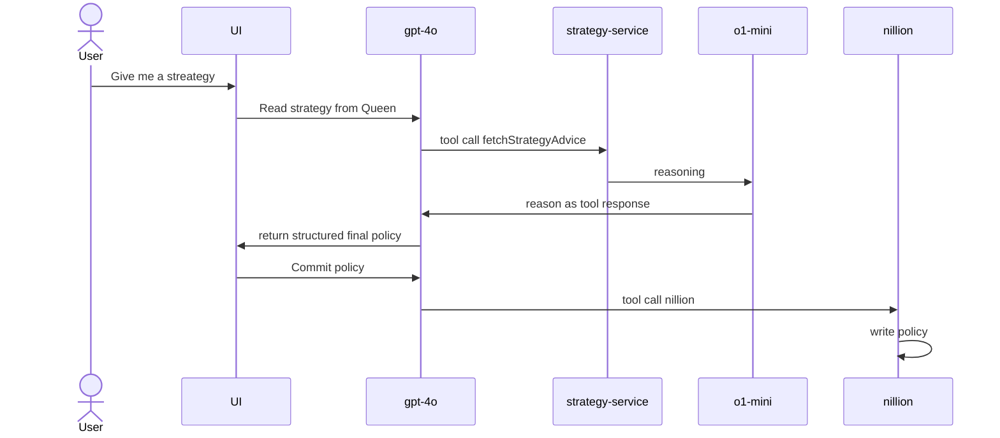

# 🐝αBees

# Short description

- AI agents gathering yield and signals with visualized strategies

# Description

### Key Features
- 📊 Visualized Market Charts
- 💬 Chat with Agent to formulate De-Fi Strategy
- 🤖 Autonomous Execution by Agents with Wallets (Coinbase MPC / EOA)
- 🌾 Yield Farming with Aave, Morpho across multiple markets

To make Defi simpler, 🐝αBees
 1. provides visual and professional strategies with data and expert advices. 
 1. effortless by with agents automatically deposit and rebalance for you

While staying safe and private
 - strategy are not disclosed  
 - risk guardrails with segregated wallets

# How it's made

## Architecture

We decoupled "Hive" and "Garden", responsible for strategy and execution respectively
This design help us to interact with agent on reasoning model to formulate strategy and data pipelines, while achieve low latency, private execution with agents on isolated wallets guardrails.

- Base on CDP agentkit and We've implemented our own [https://github.com/coinbase/agentkit/issues/323](Aave v3 Action Provider)
- Agents are deployed on [Autonome](https://dev.autonome.fun/) with [Live UI demo](https://alpha-bees.onrender.com)

### Hive Component - Strategy formulation
- This is where agents gather data and formulate strategy with users
- For strategy, we use reasoning model such as o3-mini/o1-mini/deepseek R1/framework of multiple agents. We coin this "Queen LLM"
- This allow us to benefit from more data and context
- Chat is generally based on gpt-4o, low latency model
- The strategy can be configured by user input
- Agent will elaborate research rationale and store policy onto nillion for workers private consumption
- Data such as Defillama will be fetched both during chat and at the background
- Data are visualized -- LLMs provide structured output, and the frontend renders components based on OnchainKit and @geist/dappkit.

### Garden Component – Trade Execution
- Each "Worker Bee" (Agent) is responsible for one market (e.g. USDC of Aave on base-sepolia).
- Agents will tap into real-time data and execute trades based on a predefined policy.
- Execution can be implemented through simple algorithms or via a worker LLM that opts for low cost and low latency (e.g., gpt-4o).
- Agents read policies from Nillion, which are JSON-based and include both strategy and guardrails:
  - They incorporate prompting mechanisms and numerical conditions.
  - Policies and reference signals remain encrypted until execution to prevent sandwich attacks.
- Agents are able to generate final instructions using the policy, which is protocol-specific (e.g., staking, swapping, supplying for yield, etc.).
- Agents evaluate on-chain portoflio of all agents. They listen to transactions from other agents and act to achieve low-latency risk management, although they don't talk directly to each other  
- For demo purposes, perform rebalancing on Aave and Morpho.

### For visualized charts
- base on @geist/dapp-kit
  - data is pulled from defillama

### Flow

# Development

- Setup .env per .env.example

- start web server with `env-cmd pnpm --filter web dev `

- start worker with `cd apps/worker-bee && env-cmd -f ../../.env pnpm run start:server`

- worker is dockerized