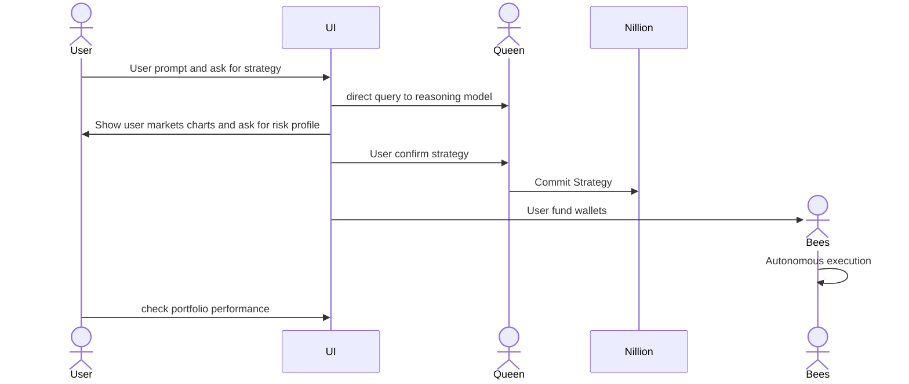
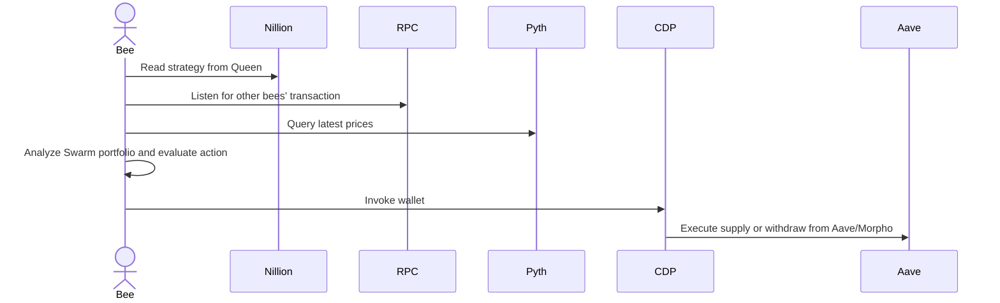
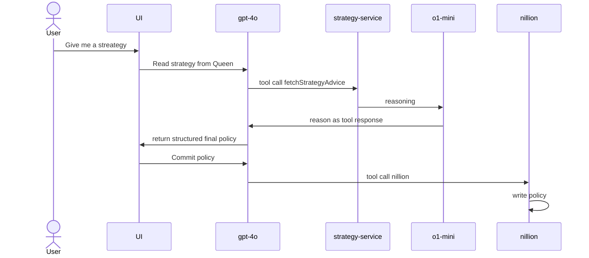

# 🐝αBees

# Short description

- AI agents gathering yield and signals with visualized strategies

# Description

### Key Features
- 📊 Visualized Market Charts
- 💬 Chat with Agent ti formulate De-Fi Strategy
- 🤖 Autonomous Execution by Agents with Wallets
- 🌾 Yield Farming with Aave, Morpho

To make Defi simpler, 🐝αBees make it
 1. more visual to evaluate strategies with data and expert advices. 
 1. less work with agents automatically deposit and rebalance for you

While staying safe and private
 - strategy are not disclosed  
 - risk guardrails with segregated wallets

# How it's made

## Architecture

We decoupled "Hive" and "Garden", responsible for strategy and execution respectively
This design help us to interact with agent on reasoning model to formulate strategy and data pipelines, while achieve low latency, private execution with agents on isolated wallets guardrails.

### Hive Component - Strategy formulation
- This is where agents gather data and formulate strategy with users
- Designed for high latency which allow us to benefit from reasoning model such as o3-mini, deepseek R1 and framework of multiple agents. We coin this "Queen LLM"
- The strategy can be configured by user input
  - data sources to consume, corresponding reputaiton
   - only use posts from certain twitter accounts or ipfs content behind particular ENS/basename that has reputation threshold    
   - this is a clear objective function (maximize profit) with risk and data consumption criteria 
- Agent will elaborate research rationale and store policy onto IPFS for workers consumption
- Data will be fetched at desired intervals

### Garden Component – Trade Execution
- Each "Bee" (Agent) is responsible for one market (e.g. USDC of Aave on base-sepolia).
- Agents will tap into real-time data and execute trades based on a predefined policy.
- Execution can be implemented through simple algorithms or via a worker LLM that opts for low cost and low latency (e.g., GPT-4).
- Policies are JSON-based and include both strategy and guardrails:
  - They incorporate prompting mechanisms and numerical conditions.
  - Policies and reference signals remain encrypted until execution to prevent sandwich attacks.
- Agents are able to generate final instructions using the policy, which is protocol-specific (e.g., staking, swapping, supplying for yield, etc.).
- This approach provides guardrails for trading execution.
- For demo purposes, perform rebalancing on Aave and Morpho

ges, we believe it is important to visualize and elaborate on the strategy.
- LLMs provide structured output, and the frontend renders components based on OnchainKit and @geist/dappkit.

### For visualized charts
- base on @geist/dapp-kit
  - data is pulled from defillama

### Flow

# Development

- Setup .env per .env.example

- start web server with env-cmd pnpm --filter web dev 